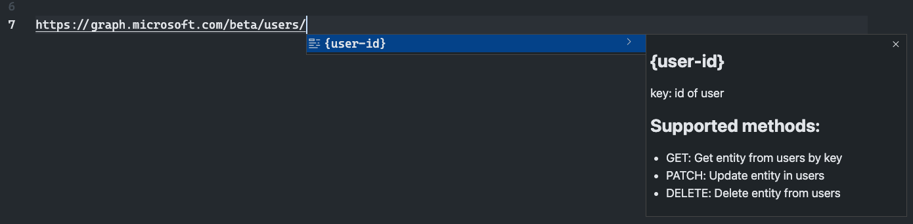
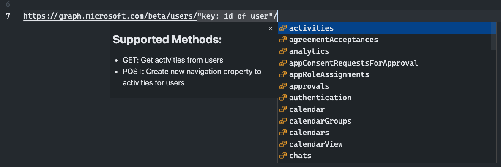

  

<h1 align="center">MS Graph Completion</h1>

  

  
  
  

This VSCode extension allows you to auto-complete the Microsoft Graph API URLs you are writing. You get the most useful Microsoft Graph Explorer functionality in your favorite editor.

> **Info**: The extension does this with the help of the APIs behind the Microsoft Graph Explorer.

## Usage

Start typing `https://graph.microsoft.com/`, and you will automatically get suggestions to autocomplete the URL with API paths, query string parameters, and values.

### Tokens

The extension lets you know when you can insert values like the `user ID`, `UPN`, `group ID`, and more. It will do this for the known paths which are registered in the [tokens.json](./src/tokens.json) file.

> **Info**: The `tokens.json` file is automatically updated during the release process of the extension.

### Method(s)

During the build and release process of the extension, it fetches the metadata from Microsoft Graph and creates a library of known API endpoints. With this library, the extension is able to show you which API methods are available per endpoint.

The extension does this as well for the endpoints with tokens:

### Commands

#### MS Graph: Clear autocomplete cache

By default, the cached data persists for 5 days. If you want, you can always clear the cache by using the *MS Graph: Clear autocomplete cache* (`msgraph.autocomplete.clearCache`) command.

## What is supported?

Currently, the extension only supports the `GET` requests for the Microsoft Graph.

## Contributing

If you find this a useful extension and want to see more functionalities added. Feel free to contribute: [GitHub Repository](https://github.com/estruyf/vscode-msgraph-autocomplete).

## Feedback / issues / ideas

Please submit them via creating an issue in the project repository: [issue list](https://github.com/estruyf/vscode-msgraph-autocomplete/issues).

  

